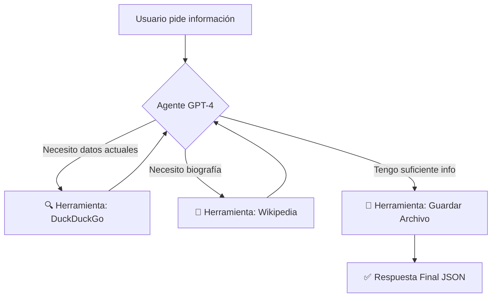

# 🤖 AI Autonomous Research Agent

> **Un agente inteligente capaz de investigar, razonar y generar informes estructurados de forma autónoma.**

---

## 💡 ¿Qué hace este proyecto?

Este no es un simple chatbot. Es un sistema de **Agentes Autónomos** diseñado para realizar tareas de investigación completas sin supervisión humana.

El agente recibe un tema (ej: *"Investiga sobre el CEO de OpenAI"*) y sigue su propio flujo de pensamiento:

1.  🧠 **Razona:** Decide qué información le falta y dónde buscarla.
2.  🔎 **Investiga:** Navega por internet en tiempo real usando **DuckDuckGo**.
3.  📚 **Contrasta:** Consulta **Wikipedia** para obtener contextos biográficos y definiciones precisas.
4.  💾 **Persiste:** Guarda automáticamente los hallazgos en archivos de texto locales.
5.  ✅ **Estructura:** Entrega un resumen final en formato JSON limpio y validado.

---

## 🛠️ Tecnologías & Arquitectura

El proyecto combina las herramientas más potentes del ecosistema de IA actual:

| Tecnología | Función en el Proyecto |
| :--- | :--- |
| **🐍 Python 3.12** | Lenguaje base del desarrollo. |
| **🦜🔗 LangChain** | Orquestación del agente y gestión de herramientas (Tool Calling). |
| **🧠 GPT-4o** | El "cerebro" que toma decisiones y procesa el lenguaje natural. |
| **🛡️ Pydantic** | Validación estricta de datos para asegurar salidas sin errores. |
| **🌐 DuckDuckGo & Wiki API** | Herramientas externas que el agente aprende a usar. |

---

## 📸 Flujo de Trabajo Real

El agente no sigue un script fijo; **toma decisiones en tiempo real**:

---

### 🚀 Estado del Proyecto
Este proyecto es funcional y demuestra la capacidad de integrar **LLMs con herramientas externas** para resolver problemas del mundo real.

---
*Developed by Vanessa Larrosa*
